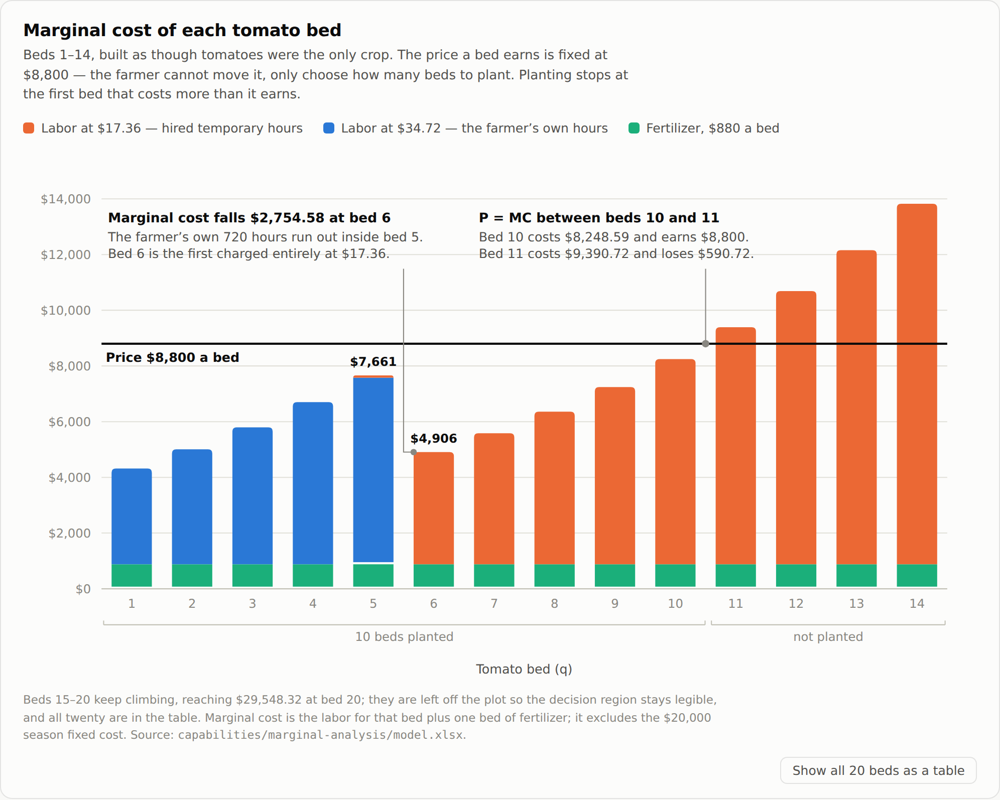
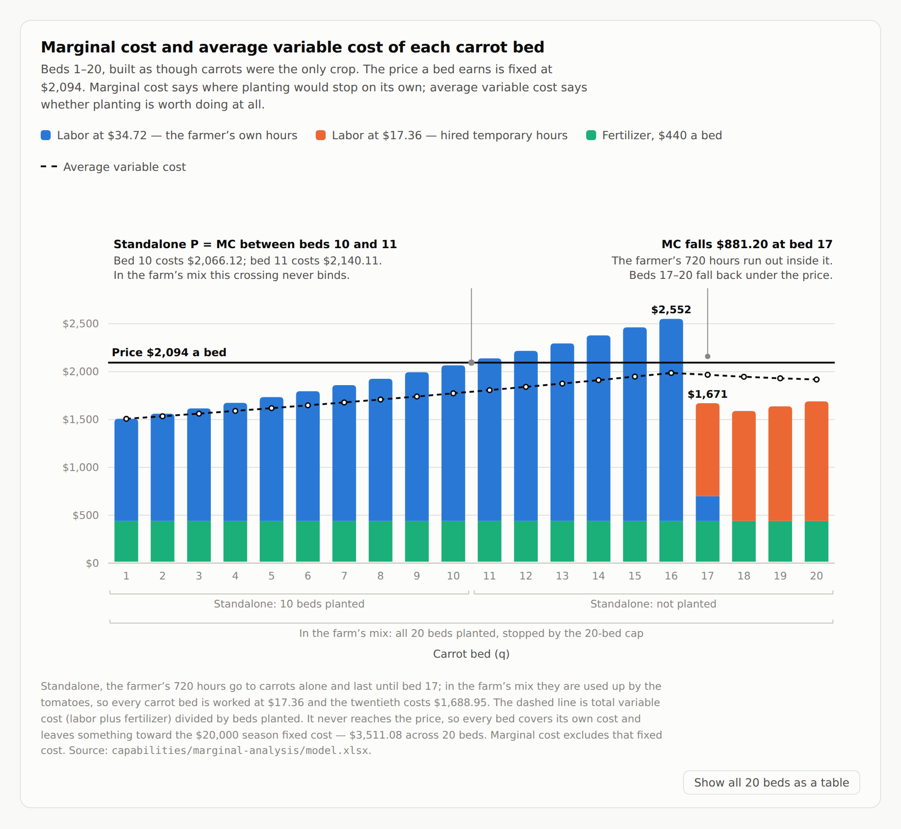
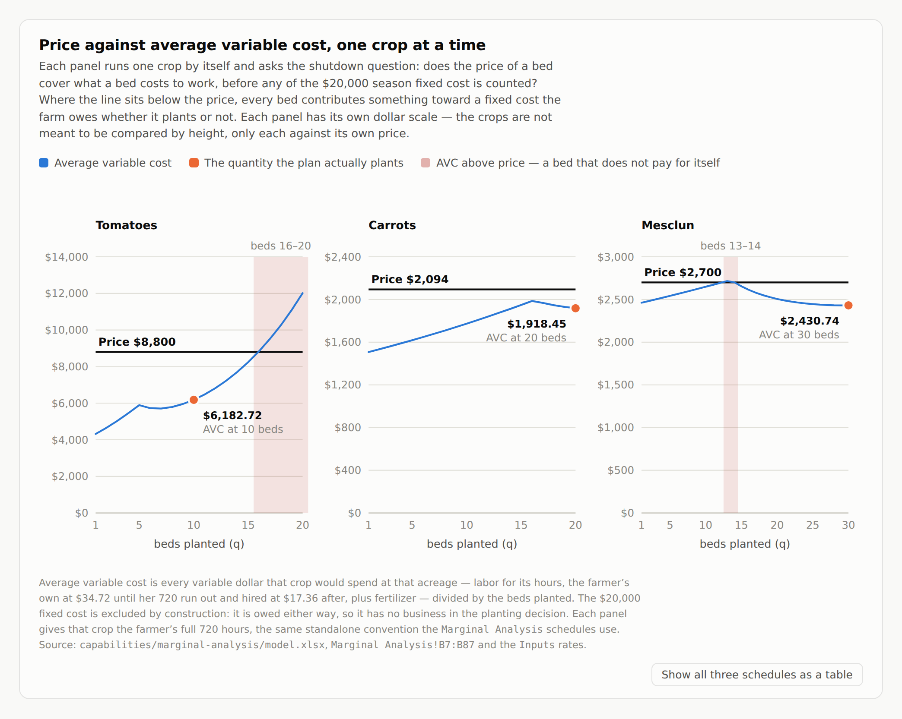

# Perfect Competition — Analysis

**Author:** Cori Mackie
**Capability:** `marginal-analysis` · **Engagement:** `perfect-competition`
**Brief:** [`docs/briefs/perfect-competition-brief.md`](../docs/briefs/perfect-competition-brief.md)
**Model:** [`capabilities/marginal-analysis/model.xlsx`](../capabilities/marginal-analysis/model.xlsx)

---

## Why tomatoes stop at 10 beds

In my analysis the tomatoes stop at 10 beds (`Marginal Analysis!B92`) but actually
stop somewhere between 10 and 11. Any additional beds after that is not worth
planting because of the rise in labor cost. The reason why we stop planting is the
cap for mesclun and carrots for tomatoes it is the labor. Bed 11 costs $9,390.72
(`Marginal Analysis!G18`), and $8,510.72 of that is labor — 90.6% (490.22 temp
hours at `E18`, priced at `Inputs!B43`). Fertilizer is flat at $880 a bed
(`Inputs!B19`), so every dollar of the rise in every MC curve here is labor hours.
Beds 9, 10, 11 go $7,243.78 → $8,248.59 → $9,390.72 (`G16:G18`), and the entire
climb is the escalating hours (`C16:C18`). The climb and the crossing are plotted
in `figures/tomato-marginal-cost.png`.

## What stops carrots and mesclun, and what moving it is worth

For the beds of carrot and mesclun it never is in the negative before the caps
(`I33:I52` and `I58:I87`), what stops them is the limit. In the 20th carrot bed the
earned would be $405.05 (`I52`) and the 21st it begins to go down at $352.49 (not
in the workbook — a 21st bed is past the schedule; derived). The 30th mesclun bed
earns $279.90 (`I87`) and the 31st would be $246.47 (derived). Both crops are
making money but the farmer cannot continue due to the fence. One more bed of
carrots in the ground outranks one more bed of mesclun in the ground. $352.49 is
the most that she should pay per season for carrots, per bed. The carrot schedule
and the bed the cap forbids are in `figures/carrot-marginal-cost.png`.

## Why grow crops that lose money on their own

Although it looks like carrots run at a deficit and may not be worth planting, the
planting of all three allows the cost to be divided by all crops. Each carrot bed
does cover its own working cost — $2,094 in, $1,918.45 out, with $175.55 left over
× 20 beds, $3,511 in all. That money goes towards the $20,000 she owes whether she
plants or not. The crop gives her money she wouldn't have so it is worth planting.
Even if you assign or account for the $20,000, it does not change the fact that the
bed pays.

Average variable cost is every variable dollar a crop spends at that acreage —
labor for its hours, plus fertilizer — divided by the beds planted. It excludes
the $20,000 fixed cost, which is owed whether or not anything is planted. AVC is
not a cell in the workbook: it is built from the labor hours in
`Marginal Analysis!B7:B87` and the rates on `Inputs`.

| At the quantity the plan plants | AVC | Price | Price − AVC |
|---|---|---|---|
| Tomatoes, 10 beds | $6,182.72 | $8,800 | +$2,617.28 |
| Carrots, 20 beds | $1,918.45 | $2,094 | +$175.55 |
| Mesclun, 30 beds | $2,430.74 | $2,700 | +$269.26 |

The three crops contribute $62,761.66 between them (`Optimization!G40`), the
$20,000 comes off that, and the farm clears $42,761.66 (`Optimization!B32`).

Run alone, each crop carries the whole $20,000 by itself:

| Run alone, at its best quantity | Season result |
|---|---|
| Carrots, 20 beds | −$16,488.92 |
| Mesclun, 30 beds | −$11,922.19 |
| Tomatoes, 10 beds | +$6,172.77 |

At first glance, price exceeds AVC in all vegetable beds, so they all contribute
but run any single crop by itself it loses money. Looking closer Mesclun's AVC is
$2,716.35 at bed 13 and $2,702.51 at bed 14, against a $2,700 price. Tomatoes'
passes $8,800 at bed 16 and never returns. Tomatoes make $6,172.77 at 10 beds. So
defined the price covers the AVC where vegetables are planted optimally. The rule
is still the answer of 10/20/30 but that is because of the schedule not because of
the individual property of the crop. Mesclun AVC climbs while beds are being
utilized at the farmer's $34.72 peaks at 13 and starts going down, where the
farmer's hours run out and the temp labor of $17.36 take over. That same switch
causes the tomato to dip in the marginal cost, and here it shows in the average. So
the rule that is true everywhere doesn't need to be verified. But it is important
to look at the rule in individual cases. If a farmer were to expand mesclun from
12 - 14 with the rule that price always cover AVC would be making a loss. So you
need to verify by type and not as a general overview.

